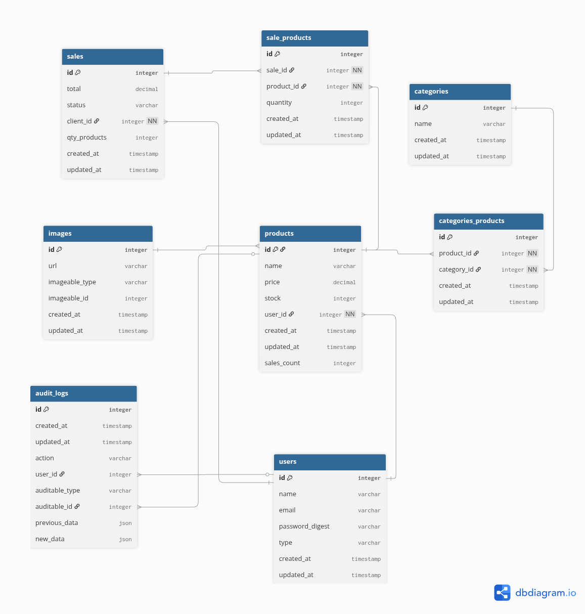

# Prueba Puntospoint

Descripción breve de la aplicación.

## Requisitos

Antes de comenzar, asegúrate de tener instalados los siguientes programas en tu máquina:

- Ruby (versión 3.3.0 o superior)
- Rails (versión 8.0.2 o superior)
- PostgreSQL (versión 12 o superior)
- Bundle (2.5.3 o superior)
- Redis

## Instalación

Sigue estos pasos para configurar y ejecutar la aplicación en tu entorno local.

### 1. Clonar el repositorio

```bash
git clone https://github.com/adrianjguerrero/puntospoint-test
```
### 2. Instala dependencias
```bash
cd puntospoint-test
bundle install
```

### 3. Copia el .env y agrega tu secret jwt
```bash
cp .env.example .env
```

### 4. Configura la base de datos
```bash
rails db:migrate
rails db:seed
```

### 5. Corre el servidor
```bash
rails s
```

### Algunas pruebas disponibles
```bash
rspec test/controllers/sale_controller_spec.rb
rspec test/controllers/stadistic_controller_spec.rb
```
### Documentación
puedes ir a la documentación de [swagger](http://localhost:3000/api-docs/index.html) para ver de forma interactiva los endpoints

tambien aqui puedes ver un [diagrama](https://dbdiagram.io/d/68799971f413ba350875c58a)

Imagen:



